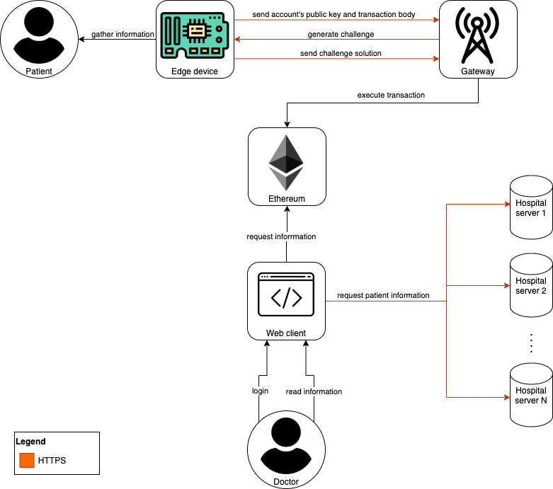

# HealthcareEnabledBlockchain

The growth in technology industry over the last few years has driven other sectors, not really tied to it, to improve the available services to their customers. An example is the healthcare sector, which nowadays is able to provide support even in a remote way, raising several problems, such as the lack of a shared patient's history among different infrastructure. Each individual infrastructure relies on its own centralised system with a single database (and perhaps with a single point of failure). This problem leads to a more serious one: patients leave data scattered across various jurisdictions as life events take them away from one provider's data silo and into another. In doing so they lose easy access to past data, as the provider, not the patient, generally retains primary stewardship. Interoperability challenges between different provider and hospital systems pose additional barriers to effective data sharing. This lack of coordinated data management and exchange means health records are fragmented, rather than cohesive. Patients and providers may face significant hurdles in initiating data retrieval and sharing due to economic incentives that encourage "health information blocking".
Exploiting Blockchain, this project aims to overcome all of these problems, by creating a unique and secure healthcare network in which all patients' data will be stored, without the need to set up any centralized data storage system, and providing easy way to access to such data everytime and everywhere. The objective of this project is to show the efficiency of Blockchain applied in the Healthcare sector. The purpose is to prove, through a little prototype system, how diverse health infrastructures (such as hospitals, clinics, emergency medical services, and so on) can benefit from a unified, secure and reliable system based on Blockchain technology.

## Architecture



The proposed solution provides each patient with the possibility (i.e., account) to measure body data (e.g., blood pressure, bpm, oxygen level, etc.) through an edge device equipped with ad-hoc sensors. This data will be then sent over the blockchain network (e.g., Ethereum) through a gateway.

A Smart Contract is deployed over the Ethereum network, which is capable of executing code whenever a transaction is made in order to store the information of the patients over the distributed network.
In the Smart Contract are defined two different actors:

- Patient
- Guest

The possibility of adding information on the blockchain through the smart contract is limited only to the Patient, while all the reading operations are allowed also to the guests. A patient is a guest specialisation.

Thus, each doctor will be able to easily access to data of each patient by using a client (e.g., web client) acting as a guest on the blockchain.

Since there is no possibility to have access to ad-hoc medical sensory devices, each edge-device will be emulated using a Raspberry Pi, which will be in charge to generate patients' sensed data and make transactions in order to store them over the Ethereum network. A gateway could be either a Raspberry Pi or a more powerful computer, which is more recommended since it has to manage more resource-intensive tasks. The connection between each pair edge-device/gateway is secured by using the HTTPS protocol, and each device will be identified by a challenge/solution system. More specifically, we make sure that each person's device is uniquely identified by its own private key, which only the owner should know. 

So, the edge-device sends the account's public key to the gateway, alongside the acquired data; the gateway will generate a challenge that consists of a random string encrypted with the user's public key, which can be decrypted only by the corresponding private key. This challenge is then sent back to the edge-device, is being decrypted, and the solution is provided to the gateway, which will be sure of the identity of the edge-device.
After this proper authentication, the gateway sends the transaction with the received user data on the blockchain.

Each hospital will have its own server, and a web client can interface with all of them once at a time. At the login phase, a doctor can choose to which hospital wants to login to. The communication between web client and the hospitals servers is secured by using the HTTPS protocol, and the doctor session and identity is secured by using a token encrypted with RSA256. With the web client, a doctor can access to its own patients data and add new ones.


## Initialization

```bash
npm install
```

```bash
cd client
npm install
```

## Deploy

```bash
npx ganache-cli --deterministic
```

```bash
npx oz deploy
```

```bash
cd client
npm start
```
